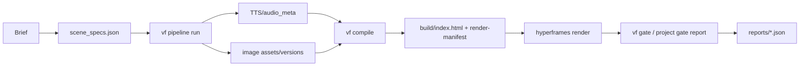

<h3 align="center"><a href="README.md">한국어</a> | English | <a href="README-ja.md">日本語</a></h3>

<h1 align="center">ReelForge</h1>

<p align="center">
  <a href="#"></a>
  <a href="LICENSE"></a>
  <a href="#"></a>
</p>

ReelForge is an **agent-native AI video factory** that keeps briefs, narration, scene contracts, HTML compilation, local rendering, and gate reports on one auditable path. The default stack should be keyless and free to reproduce, prioritizing `hyperframes@0.7.26`, local Chrome/ffmpeg, and mock or keyless adapters. The Korean README is canonical; this English file mirrors the same section keys.

## [overview] Project Overview

ReelForge is a video-production repository shaped for agent-driven edits and verification. Users describe scene intent and narration in `scene_specs.json`, then the pipeline runs TTS, images, compilation, rendering, and gate verification in order. Generated HTML is a build artifact, so edits go through contract files followed by recompilation.

The proven scope is P0~P3. P4~P6 are roadmap items, not completed product claims. In particular, P0c proved word extraction, monotonicity, audio-duration consistency, and static Korean rendering; it did not prove word-level subtitle rendering quality.

## [architecture] Architecture



| Layer | Responsibility | Current Status |
|---|---|---|
| L0 Contracts | Schemas and semantic checks for `scene_specs`, `audio_meta`, `design-tokens`, `versions`, and `render-manifest` | Native-gated in P1 |
| L1 Pipeline | TTS, images, compile, render, gate ordering and resumable state | Proven with mock/real profiles in P3 |
| L2 Compiler | Convert contracts into deterministic HyperFrames HTML and `render-manifest` | Proven with eight blocks and transitions in P2 |
| L3 Studio | Adapter-hosted preview and schema-driven editing surface | P4 roadmap; current server surface is experimental |
| L4 Gates/Packaging | Report generation, report verification, regression evidence, skill packaging | P0~P3 reports exist; P6 packaging is planned |

## [proof-results] P0~P3 Proof Results

The table below uses only values read from `git log --oneline` and the current `reports/*.json`. Reports are the files present in the working tree as of 2026-07-07 KST, and do not imply P4~P6 completion.

| Phase | Git Evidence | Reports Evidence | Measured Result | Boundary |
|---|---|---|---|---|
| P0 PoC migration | `756a8f1 init`, migrated passing P0 PoC assets | `p0a`~`p0d` 4/4 PASS, checks 23/23 | P0a 5.0s H.264 yuv420p MP4 at 74,557 bytes, P0b scene2 150/150 frame hashes matched and orphan render exit 0, P0c edge-tts words 10 and 20/20 stress successes, P0d selective re-TTS shifted s03 by 355 frames and observed one SSE event | P0c is not proof of word-level subtitle render quality |
| P1 contracts/gates | `c5096c1 P1 complete`, mentions negative 57/57 and U-3 20/20 rejection | L0 reports 4/4 PASS, checks 8/8 | Five schemas compiled, eight contract files semantically checked, 26 asset refs checked, zero duration-intrusion violations | Studio and long-video regression are not included |
| P2 compiler | `f085b91 P2 complete`, `06aabb3` mentions full-8types 33.600s render | P2 report bundle 7/7 PASS, checks 70/70 | Transition matrix 24 cases, eight block layouts, 24 PNG snapshots, full-8types MP4 10,895,535 bytes and 33.6s, determinism framemd5 314/314 matched, scene-solo body 91/91 matched | Aesthetic judgment is a P5 concern |
| P3 pipeline | `0c800e6 P3 complete`, mentions eight gates plus U-3 registration | P3 report bundle 10/10 PASS, checks 53/53 | Mock E2E `out/main.mp4` 877,606 bytes, real edge-tts one scene at 4.416s/6 words, version lifecycle node test 8/8, reroll preserved gen_01 then selected gen_02, kill/resume completed, U-3 misuse 11/11 passed | edge-tts is unofficial and is not a commercial rights basis |

## [installation] Installation

Requirements are Node.js 22, ffmpeg/ffprobe, and Chrome. `package.json` currently accepts `>=20`, but new development environments should use Node 22. Keep HyperFrames pinned to `0.7.26`; do not use `npx hyperframes@latest`.

```bash
cd ~/reelforge
npm ci
node --version
ffmpeg -version
ffprobe -version
./node_modules/.bin/hyperframes doctor
npm run lint
node bin/vf gate list
```

P0 evidence replay is the fast verification path. Only rerun render work intentionally, for example `node bin/vf gate p0b --execute`.

## [quickstart] Quick Start

The fastest local experiment is to copy an existing fixture into a project directory.

```bash
mkdir -p tmp/demo
cp fixtures/golden-specs/minimal-3scene/scene_specs.json tmp/demo/scene_specs.json
node bin/vf pipeline run tmp/demo --profile mock
```

A new project's minimal `scene_specs.json` can start from this shape. The mock profile fills `audio_meta.json`, `versions.json`, `build/`, `out/main.mp4`, and `reports/pipeline-gate-report.json`.

```json
{
  "version": "1.0.0",
  "projectId": "demo-reel",
  "scenes": [
    {
      "sceneId": "s01",
      "sceneNumber": 1,
      "narration": "오늘의 핵심 지표를 짧게 요약합니다.",
      "narration_tts": "오늘의 핵심 지표를 짧게 요약합니다.",
      "altText": "짙은 배경 위에 핵심 지표 제목이 보이는 장면.",
      "layout": "headline_only",
      "mood": "informative",
      "reveal": "fade_in",
      "emphasis": "keyword",
      "headline": "핵심 지표",
      "items": [],
      "values": [],
      "unit": "",
      "source": "demo",
      "visual_kind": "none",
      "kenBurns": { "enabled": false, "zoomFactor": 1, "zoomDirection": "in", "panDirection": "none" },
      "subtitleMode": "keyword"
    }
  ],
  "transitions": []
}
```

## [gates] Gate System

`vf gate` is the supervisor report path. Reports are written to `reports/<id>-report.json` and must contain `gate`, `pass`, `checks`, `inputSet`, `canonicalInputMerkleHash`, `evidenceHash`, `gateScriptHash`, `gitCommit`, `command`, `exitCode`, `startedAt`, and `finishedAt`.

| Command | Purpose |
|---|---|
| `node bin/vf gate list` | List registered gates and fast/full profiles |
| `npm run gate` | Replay migrated P0 evidence and fast-profile gates |
| `npm run gate:full` | Replay the full profile, including render gates |
| `node bin/vf gate p0b --execute` | Re-execute one PoC gate |
| `node bin/vf verify-report reports/p0a-report.json` | Recompute report fields, hashes, and freshness |

## [free-stack] FREE-STACK Summary

| Area | Default Choice | Key Needed | License/Warning |
|---|---|---|---|
| Render | `hyperframes@0.7.26` with local Chrome/ffmpeg | No | Apache-2.0, exact pin |
| TTS | mock TTS, optional `edge-tts` real smoke | No | `edge-tts` is LGPLv3 as a library but uses an unofficial MS path, so it is not a commercial-rights basis |
| Fonts | Pretendard Variable, D2Coding woff2 | No | OFL 1.1, license files and SHA-256 included, RFN fonts use official original builds only |
| Images | mock images or runner handoff | No | Do not commit external stock/BGM until source and redistribution rights are proven |
| BGM/SFX | No default bundle | No | Only verified CC0/CC-BY material is allowed; YAL/Pixabay standalone redistribution is forbidden |

Fonts are fetched with `node scripts/fetch-fonts.mjs`, which records byte counts and SHA-256 values in `assets/fonts/font-checksums.json`.

## [usage] CLI Documentation

The full CLI reference lives in `docs/usage.md`. The main paths are `node bin/vf compile <projectDir>`, `node bin/vf pipeline run <projectDir> --profile mock`, `node bin/vf gate --all --profile full --replay`, `node bin/vf verify-report <report.json>`, and `node bin/vf studio <projectDir> --port 3000`. Studio security and editing UX are P4 work, so the current command is treated as a local experimental surface.

## [roadmap] Roadmap

| Phase | Status | Goal |
|---|---|---|
| P4 | Roadmap | Studio adapter, schema forms, edit-impact classes, concurrent editing |
| P5 | Roadmap | Long-video memory, golden regressions, visual judgment gates |
| P6 | Roadmap | Skill packaging, multi-format output, deck-factory integration, cross-environment hashes |

P4~P6 are not described as completed product features in this README. Completion should be added only after corresponding gates and reports exist.

## [license-disclaimer] License and Disclaimer

Code is Apache-2.0. Fonts, audio, images, and TTS outputs follow their own licenses and service terms. This repository does not provide legal advice; before public distribution or commercial use, check `THIRD_PARTY_LICENSES.md` and project-level provenance. Large generated media and rights-unverified outputs should not be committed.
