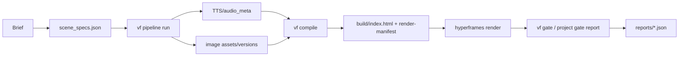

<h3 align="center"><a href="README.md">한국어</a> | <a href="README-en.md">English</a> | 日本語</h3>

<h1 align="center">ReelForge</h1>

<p align="center">
  <a href="#"></a>
  <a href="LICENSE"></a>
  <a href="#"></a>
</p>

ReelForge は、ブリーフ、ナレーション、シーン契約、HTML コンパイル、ローカルレンダー、ゲートレポートを監査可能な一本の経路にまとめる **Agent-native AI video factory** です。デフォルトスタックはキー不要かつ無料で再現できることを優先し、`hyperframes@0.7.26`、ローカル Chrome/ffmpeg、mock またはキー不要アダプターを使います。韓国語 README が正本で、この日本語版は同じセクションキーに同期します。

## [overview] プロジェクト概要

ReelForge は、エージェントが直接編集し検証しやすい動画制作リポジトリです。ユーザーは `scene_specs.json` にシーン意図とナレーションを書き、パイプラインは TTS、画像、コンパイル、レンダー、ゲート検証を順に実行します。生成 HTML はビルド成果物なので、直接編集せず契約ファイルを変更して再コンパイルします。

現時点で実証済みの範囲は P0~P3 です。P4~P6 はまだ完成機能ではなくロードマップです。特に P0c は単語抽出、単調性、音声長の整合、静的な韓国語レンダーだけを証明しており、単語単位字幕レンダー品質を証明したとは書きません。

## [architecture] アーキテクチャ



| 層 | 責務 | 現在の状態 |
|---|---|---|
| L0 契約 | `scene_specs`、`audio_meta`、`design-tokens`、`versions`、`render-manifest` のスキーマと意味検証 | P1 でネイティブゲート化 |
| L1 パイプライン | TTS、画像、コンパイル、レンダー、ゲートの順序と再開状態 | P3 で mock/real プロファイルを実証 |
| L2 コンパイラ | 契約を決定論的な HyperFrames HTML と `render-manifest` に変換 | P2 で 8 ブロックとトランジションを実証 |
| L3 Studio | adapter-hosted プレビューとスキーマ駆動の編集面 | P4 ロードマップ、現サーバー表面は実験的 |
| L4 ゲート/パッケージング | レポート生成、レポート検証、回帰証拠、スキルパッケージング | P0~P3 レポートあり、P6 パッケージング予定 |

## [proof-results] P0~P3 実証結果

下表は `git log --oneline` と現在の `reports/*.json` から読んだ値だけを書いています。レポートは 2026-07-07 KST 時点のワークツリーにあるファイルであり、P4~P6 完了を意味しません。

| 段階 | git 根拠 | reports 根拠 | 実測値 | 境界 |
|---|---|---|---|---|
| P0 PoC 移行 | `756a8f1 init`、通過済み P0 PoC 資産の移行 | `p0a`~`p0d` 4/4 PASS、checks 23/23 | P0a 5.0s H.264 yuv420p MP4 74,557 bytes、P0b scene2 150/150 フレームハッシュ一致と orphan render exit 0、P0c edge-tts words 10 と 20/20 stress 成功、P0d selective re-TTS 後 s03 が 355 フレーム移動し SSE 1 回観測 | P0c は word-level subtitle render 品質の証明ではない |
| P1 契約/ゲート | `c5096c1 P1 complete`、negative 57/57 と U-3 20/20 拒否に言及 | L0 レポート 4/4 PASS、checks 8/8 | 5 スキーマをコンパイル、契約ファイル 8 個を意味検証、asset ref 26 個を確認、duration intrusion 違反 0 個 | Studio と長尺動画回帰は含まない |
| P2 コンパイラ | `f085b91 P2 complete`、`06aabb3` が full-8types 33.600s render に言及 | P2 レポート群 7/7 PASS、checks 70/70 | transition matrix 24 cases、8 ブロックレイアウト、PNG snapshot 24 個、full-8types MP4 10,895,535 bytes と 33.6s、determinism framemd5 314/314 一致、scene solo body 91/91 一致 | 美的品質判定は P5 領域 |
| P3 パイプライン | `0c800e6 P3 complete`、8 ゲート + U-3 登録に言及 | P3 レポート群 10/10 PASS、checks 53/53 | mock E2E `out/main.mp4` 877,606 bytes、real edge-tts 1 scene 4.416s/6 words、version lifecycle node test 8/8、reroll は gen_01 を保持し gen_02 を選択、kill/resume 完了、U-3 misuse 11/11 通過 | edge-tts は非公式経路で商用権利根拠ではない |

## [installation] インストール

必要要件は Node.js 22、ffmpeg/ffprobe、Chrome です。`package.json` は現在 `>=20` を許可していますが、新しい開発環境は Node 22 に合わせます。HyperFrames は必ず `0.7.26` に固定し、`npx hyperframes@latest` は使いません。

```bash
cd ~/reelforge
npm ci
node --version
ffmpeg -version
ffprobe -version
./node_modules/.bin/hyperframes doctor
npm run lint
node bin/vf gate list
```

P0 evidence replay が高速な検証経路です。レンダーを実際に再実行する場合だけ、`node bin/vf gate p0b --execute` のように明示します。

## [quickstart] クイックスタート

最速のローカル実験は、既存 fixture をプロジェクトディレクトリへコピーする方法です。

```bash
mkdir -p tmp/demo
cp fixtures/golden-specs/minimal-3scene/scene_specs.json tmp/demo/scene_specs.json
node bin/vf pipeline run tmp/demo --profile mock
```

新規プロジェクトの最小 `scene_specs.json` は次の形から始められます。mock プロファイルは `audio_meta.json`、`versions.json`、`build/`、`out/main.mp4`、`reports/pipeline-gate-report.json` を生成します。

```json
{
  "version": "1.0.0",
  "projectId": "demo-reel",
  "scenes": [
    {
      "sceneId": "s01",
      "sceneNumber": 1,
      "narration": "오늘의 핵심 지표를 짧게 요약합니다.",
      "narration_tts": "오늘의 핵심 지표를 짧게 요약합니다.",
      "altText": "짙은 배경 위에 핵심 지표 제목이 보이는 장면.",
      "layout": "headline_only",
      "mood": "informative",
      "reveal": "fade_in",
      "emphasis": "keyword",
      "headline": "핵심 지표",
      "items": [],
      "values": [],
      "unit": "",
      "source": "demo",
      "visual_kind": "none",
      "kenBurns": { "enabled": false, "zoomFactor": 1, "zoomDirection": "in", "panDirection": "none" },
      "subtitleMode": "keyword"
    }
  ],
  "transitions": []
}
```

## [gates] ゲート体系

`vf gate` は supervisor report 経路です。レポートは `reports/<id>-report.json` に書かれ、`gate`、`pass`、`checks`、`inputSet`、`canonicalInputMerkleHash`、`evidenceHash`、`gateScriptHash`、`gitCommit`、`command`、`exitCode`、`startedAt`、`finishedAt` を持つ必要があります。

| コマンド | 用途 |
|---|---|
| `node bin/vf gate list` | 登録ゲートと fast/full プロファイルを確認 |
| `npm run gate` | 移行済み P0 証拠と fast プロファイルゲートを replay |
| `npm run gate:full` | render を含む full プロファイルを replay |
| `node bin/vf gate p0b --execute` | 特定 PoC ゲートを実再実行 |
| `node bin/vf verify-report reports/p0a-report.json` | レポートフィールド、ハッシュ、freshness を再計算 |

## [free-stack] FREE-STACK 要約

| 領域 | デフォルト選択 | キー必要 | ライセンス/注意 |
|---|---|---|---|
| レンダー | `hyperframes@0.7.26` + ローカル Chrome/ffmpeg | なし | Apache-2.0、厳密固定 |
| TTS | mock TTS、任意の `edge-tts` real smoke | なし | `edge-tts` ライブラリは LGPLv3 だが MS 非公式経路なので商用権利根拠にはしない |
| フォント | Pretendard Variable、D2Coding woff2 | なし | OFL 1.1、ライセンスファイルと SHA-256 同梱、RFN フォントは公式原型のみ |
| 画像 | mock 画像または runner handoff | なし | 外部 stock/BGM は出典と再配布権利が確定するまでコミット禁止 |
| BGM/SFX | デフォルトバンドルなし | なし | 検証済み CC0/CC-BY のみ可、YAL/Pixabay standalone 再配布は禁止 |

フォントは `node scripts/fetch-fonts.mjs` で取得し、`assets/fonts/font-checksums.json` にバイト数と SHA-256 を記録します。

## [usage] CLI ドキュメント

完全な CLI リファレンスは `docs/usage.md` にあります。主要経路は `node bin/vf compile <projectDir>`、`node bin/vf pipeline run <projectDir> --profile mock`、`node bin/vf gate --all --profile full --replay`、`node bin/vf verify-report <report.json>`、`node bin/vf studio <projectDir> --port 3000` です。Studio のセキュリティと編集 UX は P4 作業なので、現在のコマンドはローカル実験表面として扱います。

## [roadmap] ロードマップ

| フェーズ | 状態 | 目標 |
|---|---|---|
| P4 | ロードマップ | Studio adapter、スキーマフォーム、編集影響クラス、同時編集 |
| P5 | ロードマップ | 長尺動画メモリ、ゴールデン回帰、視覚判定ゲート |
| P6 | ロードマップ | スキルパッケージング、マルチフォーマット、deck-factory 連携、環境間ハッシュ |

P4~P6 は、この README では完成した製品機能として記述しません。完了表示は対応ゲートとレポートが存在してから追加します。

## [license-disclaimer] ライセンスと免責

コードは Apache-2.0 です。フォント、音声、画像、TTS 出力はそれぞれのライセンスとサービス条件に従います。このリポジトリは法律助言を提供しません。公開配布または商用利用の前に、`THIRD_PARTY_LICENSES.md` とプロジェクト別 provenance を確認してください。大きな生成メディアと権利未確認の出力はコミットしません。
