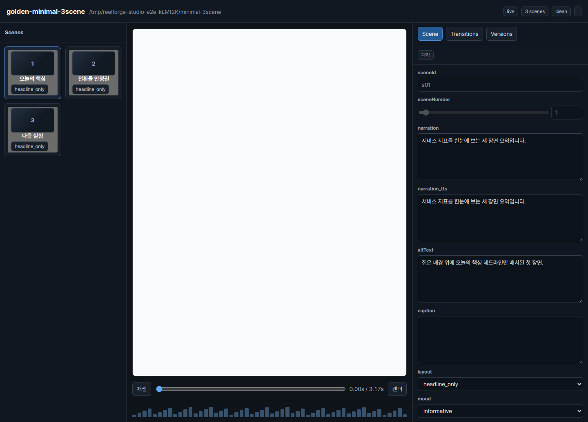

<p align="center">한국어 | <a href="README-en.md">English</a> | <a href="README-ja.md">日本語</a></p>

<p align="center"></p>
<p align="center">
  
</p>

<p align="center"><strong>ReelForge는 `scene_specs.json`을 쓰고 로컬 파이프라인을 돌려 Studio에서 바로 다듬는 키리스 AI 영상 제작 루프입니다.</strong></p>

## [quick-start] Quick Start(3분 안에 첫 영상)

레포 루트에서 그대로 실행합니다. `vf` 함수는 이 셸에서만 로컬 CLI를 짧게 부르는 이름입니다.

```bash
cd ~/reelforge
npm ci
./node_modules/.bin/hyperframes doctor

PROJECT_DIR="tmp/quickstart-reel-$(date +%Y%m%d-%H%M%S)"
mkdir -p "$PROJECT_DIR"
cp fixtures/golden-specs/minimal-3scene/scene_specs.json "$PROJECT_DIR/scene_specs.json"

vf() { node bin/vf "$@"; }
vf pipeline run "$PROJECT_DIR" --profile mock
vf studio "$PROJECT_DIR" --port 4317
```

터미널에 `studio: http://127.0.0.1:4317/panel/`가 뜨면 브라우저에서 열고 장면 문장, 레이아웃, 자막 모드를 고칩니다. 최종 영상은 `$PROJECT_DIR/out/main.mp4`에 생성됩니다.

## [features] 주요 기능

### Studio 편집 루프
`vf studio`로 씬 목록, 미리보기, 스키마 기반 폼, 버전 상태를 한 화면에서 봅니다.
문장/레이아웃 수정은 E1, TTS 문장 수정은 E2, 씬 순서/전환 수정은 E3로 분류해 필요한 재작업 범위를 알려줍니다.
<!-- SCREENSHOT: docs/images/studio-scenes.png -->

### 씬 블록 8종
`bar`, `pie`, `line`, `list`, `numbered`, `statistic`, `compare`, `quote` 블록을 `scene_specs.json`의 `layout`으로 선택합니다.
타이틀/엔딩용 `headline_only`도 쓸 수 있지만, 본문 장면은 8개 블록 중 하나로 시작하는 편이 빠릅니다.
<!-- SCREENSHOT: docs/images/blocks-8.png — 데모 렌더 후 블록 갤러리 삽입 -->

### 멀티포맷
컴파일러는 `16:9`, `9:16`, `1:1` 캔버스를 지원하고 포맷별 자막 안전 영역과 override를 반영합니다.
예: `vf compile "$PROJECT_DIR" --format 9:16 --json`.
<!-- SCREENSHOT: docs/images/multiformat.png — 16:9/9:16/1:1 비교 삽입 -->

### 무료 키리스 스택
기본 경로는 mock TTS, mock image, 로컬 Chrome/ffmpeg, `hyperframes@0.7.26`로 API 키 없이 재현됩니다.
real TTS/image runner는 선택 사항이며, 권리와 서비스 조건은 프로젝트별 provenance로 확인합니다.
<!-- SCREENSHOT: docs/images/keyless-stack.png — 로컬 산출물 흐름 삽입 -->

## [demos] 데모 3종

| 데모 | 용도 | 스펙 | 릴리스 |
|---|---|---|---|
| D1 Usage | 설치부터 Studio 확인까지 사용 흐름을 보여주는 튜토리얼 영상 | `demos/d1-usage/scene_specs.json` | [d1-usage.mp4](https://github.com/kimsh-1/reelforge/releases/download/v0.1.0/reelforge-d1-usage.mp4) |
| D2 Engine | HTML 컴파일, seek 결정론, 게이트 구조를 짧게 설명하는 엔진 소개 | `demos/d2-engine/scene_specs.json` | [d2-engine.mp4](https://github.com/kimsh-1/reelforge/releases/download/v0.1.0/reelforge-d2-engine.mp4) |
| D3 Intro | ReelForge를 처음 보는 사람에게 보여줄 브랜드/제품 인트로 | `demos/d3-intro/scene_specs.json` | [d3-intro.mp4](https://github.com/kimsh-1/reelforge/releases/download/v0.1.0/reelforge-d3-intro.mp4) |

## [skill] Claude Code에서 SKILL 사용

Claude Code에서 이 레포를 열고 `skills/reelforge/SKILL.md`를 프로젝트 스킬로 등록하거나 참조합니다.
요청은 "ReelForge 스킬로 브리프를 `scene_specs.json`으로 만들고 mock 파이프라인까지 돌려줘"처럼 시작하면 됩니다.
스킬은 브리프 확인, 씬 작성, `vf pipeline run`, 게이트 확인, Studio 리뷰 순서로 작업을 안내합니다.

## [reference] 설정 레퍼런스

CLI 옵션과 설정은 [docs/usage.md](docs/usage.md)에 있습니다. Studio 세부 동작은 [docs/studio.md](docs/studio.md), 파이프라인 재개/dirty guard는 [docs/pipeline.md](docs/pipeline.md)를 봅니다.

## [validation] 프로젝트가 어떻게 검증됐나

P0~P3 실증 결과, 게이트 세부, 아키텍처 기록은 [docs/build-journey.md](docs/build-journey.md)로 옮겼습니다.

## [license-disclaimer] 라이선스와 면책

코드는 Apache-2.0입니다. 폰트, 음원, 이미지, TTS 산출물은 각자 라이선스와 서비스 조건을 따르며, 공개 배포 또는 상업 사용 전에는 프로젝트별 provenance를 확인해야 합니다.
