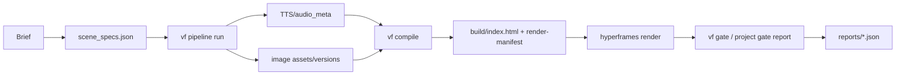

# ReelForge

<h3 align="center">한국어 | <a href="README-en.md">English</a> | <a href="README-ja.md">日本語</a></h3>

<h1 align="center">ReelForge</h1>

<p align="center">
  <a href="#"></a>
  <a href="LICENSE"></a>
  <a href="#"></a>
</p>

ReelForge는 브리프, 나레이션, 씬 계약, HTML 컴파일, 로컬 렌더, 게이트 리포트를 한 경로로 묶는 **Agent-native AI video factory**입니다. 기본 스택은 키 없이 무료로 재현 가능해야 하며, `hyperframes@0.7.26`, 로컬 Chrome/ffmpeg, mock 또는 키리스 어댑터를 우선합니다. 이 README의 한국어 문서가 정본이며 영어와 일본어 문서는 같은 섹션 키로 동기화됩니다.

## [overview] 프로젝트 소개

ReelForge는 에이전트가 직접 수정하고 검증하기 쉬운 비디오 제작 레포입니다. 사용자는 `scene_specs.json`에 장면 의도와 나레이션을 적고, 파이프라인은 TTS, 이미지, 컴파일, 렌더, 게이트 검증을 순서대로 수행합니다. 생성 HTML은 빌드 산출물이므로 직접 편집하지 않고 계약 파일을 수정한 뒤 다시 컴파일합니다.

현재 검증된 범위는 P0~P3입니다. P4~P6은 아직 제품 완료가 아니라 로드맵입니다. 특히 P0c는 단어 추출, 단조성, 오디오 길이 정합, 정적 한글 렌더만 증명했고, 단어 단위 자막 렌더 품질을 P0에서 증명했다고 쓰지 않습니다.

## [architecture] 아키텍처



| 계층 | 책임 | 현재 상태 |
|---|---|---|
| L0 계약 | `scene_specs`, `audio_meta`, `design-tokens`, `versions`, `render-manifest` 스키마와 의미 검증 | P1에서 네이티브 게이트화 |
| L1 파이프라인 | TTS, 이미지, 컴파일, 렌더, 게이트 순서와 재개 상태 | P3에서 mock/real 프로파일 실증 |
| L2 컴파일러 | 계약 파일을 결정론적 HyperFrames HTML과 `render-manifest`로 변환 | P2에서 8개 블록과 전환 실증 |
| L3 Studio | adapter-hosted 미리보기와 스키마 기반 편집면 | P4 로드맵, 현재 서버 표면은 실험적 |
| L4 게이트/패키징 | 리포트 생성, 리포트 검증, 회귀 증거, 스킬 패키징 | P0~P3 리포트 존재, P6 패키징 예정 |

## [proof-results] P0~P3 실증 결과

아래 표는 `git log --oneline`과 현재 `reports/*.json`에서 읽은 수치만 적습니다. 보고서는 2026-07-07 KST 기준 워크트리에 존재하는 리포트이며, P4~P6 완료를 의미하지 않습니다.

| 단계 | git 근거 | reports 근거 | 실측치 | 한계 |
|---|---|---|---|---|
| P0 PoC 이관 | `756a8f1 init`, P0 PoC 통과 자산 이관 | `p0a`~`p0d` 4/4 PASS, checks 23/23 | P0a 5.0s H.264 yuv420p MP4 74,557 bytes, P0b scene2 150/150 프레임 해시 일치와 orphan render exit 0, P0c edge-tts words 10개와 20/20 stress 성공, P0d 선택적 re-TTS 후 s03 시작점 355프레임 이동 및 SSE 1회 관측 | P0c는 word-level subtitle render 품질 증명이 아님 |
| P1 계약/게이트 | `c5096c1 P1 complete`, negative 57/57와 U-3 20/20 반려 언급 | L0 리포트 4/4 PASS, checks 8/8 | 스키마 5종 컴파일, 계약 파일 8개 의미 검증, asset ref 26개 확인, duration intrusion 위반 0개 | Studio와 장영상 회귀는 포함하지 않음 |
| P2 컴파일러 | `f085b91 P2 complete`, `06aabb3` full-8types 33.600s 렌더 언급 | P2 묶음 리포트 7/7 PASS, checks 70/70 | 전환 matrix 24 cases, 블록 8종, PNG snapshot 24개, full-8types MP4 10,895,535 bytes와 33.6s, determinism framemd5 314/314 일치, scene solo body 91/91 일치 | 미학적 품질 판정은 P5 영역 |
| P3 파이프라인 | `0c800e6 P3 complete`, 게이트 8종+U-3 등록 언급 | P3 묶음 리포트 10/10 PASS, checks 53/53 | mock E2E `out/main.mp4` 877,606 bytes, real edge-tts 1 scene 4.416s/word 6개, version lifecycle node test 8/8, reroll gen_01 보존 후 gen_02 선택, kill/resume 완료, U-3 misuse 11/11 통과 | edge-tts는 비공식 경로라 상업 권리 보장이 아님 |

## [installation] 설치

요구사항은 Node.js 22, ffmpeg/ffprobe, Chrome입니다. 레포의 `package.json`은 현재 `>=20`을 허용하지만, 새 개발 환경은 Node 22로 맞춥니다. HyperFrames는 반드시 `0.7.26` 고정 버전을 사용하고 `npx hyperframes@latest`를 쓰지 않습니다.

```bash
cd ~/reelforge
npm ci
node --version
ffmpeg -version
ffprobe -version
./node_modules/.bin/hyperframes doctor
npm run lint
node bin/vf gate list
```

P0 evidence replay는 빠른 검증 경로입니다. 렌더를 실제 재실행할 때만 `node bin/vf gate p0b --execute`처럼 명시합니다.

## [quickstart] 빠른 시작

가장 빠른 로컬 실험은 기존 fixture를 복사해 프로젝트 디렉터리로 쓰는 것입니다.

```bash
mkdir -p tmp/demo
cp fixtures/golden-specs/minimal-3scene/scene_specs.json tmp/demo/scene_specs.json
node bin/vf pipeline run tmp/demo --profile mock
```

새 프로젝트의 최소 `scene_specs.json`은 아래 형태에서 시작합니다. mock 프로파일은 `audio_meta.json`, `versions.json`, `build/`, `out/main.mp4`, `reports/pipeline-gate-report.json`을 채웁니다.

```json
{
  "version": "1.0.0",
  "projectId": "demo-reel",
  "scenes": [
    {
      "sceneId": "s01",
      "sceneNumber": 1,
      "narration": "오늘의 핵심 지표를 짧게 요약합니다.",
      "narration_tts": "오늘의 핵심 지표를 짧게 요약합니다.",
      "altText": "짙은 배경 위에 핵심 지표 제목이 보이는 장면.",
      "layout": "headline_only",
      "mood": "informative",
      "reveal": "fade_in",
      "emphasis": "keyword",
      "headline": "핵심 지표",
      "items": [],
      "values": [],
      "unit": "",
      "source": "demo",
      "visual_kind": "none",
      "kenBurns": { "enabled": false, "zoomFactor": 1, "zoomDirection": "in", "panDirection": "none" },
      "subtitleMode": "keyword"
    }
  ],
  "transitions": []
}
```

## [gates] 게이트 체계

`vf gate`는 supervisor report 경로입니다. 리포트는 `reports/<id>-report.json`에 쓰이며, `gate`, `pass`, `checks`, `inputSet`, `canonicalInputMerkleHash`, `evidenceHash`, `gateScriptHash`, `gitCommit`, `command`, `exitCode`, `startedAt`, `finishedAt` 필드를 가져야 합니다.

| 명령 | 용도 |
|---|---|
| `node bin/vf gate list` | 등록 게이트와 fast/full 프로파일 확인 |
| `npm run gate` | P0 이관 증거와 fast 프로파일 게이트 replay |
| `npm run gate:full` | render 포함 full 프로파일 replay |
| `node bin/vf gate p0b --execute` | 특정 PoC를 실제 재실행 |
| `node bin/vf verify-report reports/p0a-report.json` | 리포트 필드, 해시, freshness 재검증 |

## [free-stack] FREE-STACK 요약

| 영역 | 기본 선택 | 키 필요 | 라이선스/주의 |
|---|---|---|---|
| 렌더 | `hyperframes@0.7.26` + 로컬 Chrome/ffmpeg | 없음 | Apache-2.0, 버전 고정 |
| TTS | mock TTS, 선택적 `edge-tts` real smoke | 없음 | `edge-tts`는 LGPLv3 라이브러리이나 MS 비공식 API 리스크가 있어 상업 권리 근거로 쓰지 않음 |
| 폰트 | Pretendard Variable, D2Coding woff2 | 없음 | OFL 1.1, 라이선스 파일과 SHA-256 동봉, RFN 폰트는 공식 원형만 |
| 이미지 | mock 이미지 또는 runner handoff | 없음 | 외부 스톡/BGM은 출처와 재배포 권리 확인 전 커밋 금지 |
| BGM/SFX | 기본 번들 없음 | 없음 | CC0/CC-BY 검증분만 가능, YAL/Pixabay standalone 재배포 금지 |

폰트는 `node scripts/fetch-fonts.mjs`로 내려받고 `assets/fonts/font-checksums.json`에 바이트 수와 SHA-256을 기록합니다.

## [usage] CLI 문서

전체 CLI 레퍼런스는 `docs/usage.md`에 둡니다. 주요 경로는 `node bin/vf compile <projectDir>`, `node bin/vf pipeline run <projectDir> --profile mock`, `node bin/vf gate --all --profile full --replay`, `node bin/vf verify-report <report.json>`, `node bin/vf studio <projectDir> --port 3000`입니다. Studio는 P4에서 보안/편집 UX가 확정될 예정이므로 현재는 로컬 실험 표면으로만 다룹니다.

## [roadmap] 로드맵

| 단계 | 상태 | 목표 |
|---|---|---|
| P4 | 로드맵 | Studio adapter, 스키마 폼, 편집 영향 클래스, 동시 편집 처리 |
| P5 | 로드맵 | 장영상 메모리, 골든 회귀, 시각 판정 게이트 |
| P6 | 로드맵 | 스킬 패키징, 멀티포맷, deck-factory 연계, 교차환경 해시 |

P4~P6은 현재 README에서 제품 기능처럼 주장하지 않습니다. 완료 표시는 대응 게이트와 리포트가 생긴 뒤에만 추가합니다.

## [license-disclaimer] 라이선스와 면책

코드는 Apache-2.0입니다. 폰트, 음원, 이미지, TTS 산출물은 각자 라이선스와 서비스 조건을 따릅니다. 이 레포는 법률 자문을 제공하지 않으며, 공개 배포 또는 상업 사용 전에는 `THIRD_PARTY_LICENSES.md`와 프로젝트별 provenance를 확인해야 합니다. 생성된 대형 미디어와 권리 미확정 산출물은 커밋하지 않습니다.
