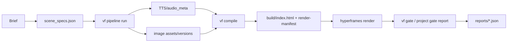

# ReelForge Build Journey

이 문서는 README에서 분리한 개발 실증 기록입니다. 메인 README는 사용법과 데모 중심으로 유지하고, 아키텍처 심화·게이트 세부·P0~P3 증거는 여기에서 추적합니다.

## 아키텍처

| 계층 | 책임 | 초기 실증 상태 |
|---|---|---|
| L0 계약 | `scene_specs`, `audio_meta`, `design-tokens`, `versions`, `render-manifest` 스키마와 의미 검증 | P1에서 네이티브 게이트화 |
| L1 파이프라인 | TTS, 이미지, 컴파일, 렌더, 게이트 순서와 재개 상태 | P3에서 mock/real 프로파일 실증 |
| L2 컴파일러 | 계약 파일을 결정론적 HyperFrames HTML과 `render-manifest`로 변환 | P2에서 8개 블록과 전환 실증 |
| L3 Studio | adapter-hosted 미리보기와 스키마 기반 편집면 | P4에서 로컬 Studio 편집 루프로 확장 |
| L4 게이트/패키징 | 리포트 생성, 리포트 검증, 회귀 증거, 스킬 패키징 | P0~P3 리포트와 이후 게이트로 확장 |

생성 HTML은 읽기 전용 빌드 산출물입니다. 장면 의도, 카피, 레이아웃, TTS 문장은 `scene_specs.json`을 수정한 뒤 다시 컴파일합니다.

## P0~P3 실증 결과

아래 표는 초기 README에 있던 `git log --oneline`과 `reports/*.json` 기반 수치를 옮긴 것입니다. 보고서는 2026-07-07 KST 기준 워크트리에 존재하는 리포트를 기준으로 작성되었습니다.

| 단계 | git 근거 | reports 근거 | 실측치 | 한계 |
|---|---|---|---|---|
| P0 PoC 이관 | `756a8f1 init`, P0 PoC 통과 자산 이관 | `p0a`~`p0d` 4/4 PASS, checks 23/23 | P0a 5.0s H.264 yuv420p MP4 74,557 bytes, P0b scene2 150/150 프레임 해시 일치와 orphan render exit 0, P0c edge-tts words 10개와 20/20 stress 성공, P0d 선택적 re-TTS 후 s03 시작점 355프레임 이동 및 SSE 1회 관측 | P0c는 word-level subtitle render 품질 증명이 아님 |
| P1 계약/게이트 | `c5096c1 P1 complete`, negative 57/57와 U-3 20/20 반려 언급 | L0 리포트 4/4 PASS, checks 8/8 | 스키마 5종 컴파일, 계약 파일 8개 의미 검증, asset ref 26개 확인, duration intrusion 위반 0개 | Studio와 장영상 회귀는 포함하지 않음 |
| P2 컴파일러 | `f085b91 P2 complete`, `06aabb3` full-8types 33.600s 렌더 언급 | P2 묶음 리포트 7/7 PASS, checks 70/70 | 전환 matrix 24 cases, 블록 8종, PNG snapshot 24개, full-8types MP4 10,895,535 bytes와 33.6s, determinism framemd5 314/314 일치, scene solo body 91/91 일치 | 미학적 품질 판정은 P5 영역 |
| P3 파이프라인 | `0c800e6 P3 complete`, 게이트 8종+U-3 등록 언급 | P3 묶음 리포트 10/10 PASS, checks 53/53 | mock E2E `out/main.mp4` 877,606 bytes, real edge-tts 1 scene 4.416s/word 6개, version lifecycle node test 8/8, reroll gen_01 보존 후 gen_02 선택, kill/resume 완료, U-3 misuse 11/11 통과 | edge-tts는 비공식 경로라 상업 권리 보장이 아님 |

## 게이트 체계

`vf gate`는 supervisor report 경로입니다. 리포트는 `reports/<id>-report.json`에 쓰이며, `gate`, `pass`, `checks`, `inputSet`, `canonicalInputMerkleHash`, `evidenceHash`, `gateScriptHash`, `gitCommit`, `command`, `exitCode`, `startedAt`, `finishedAt` 필드를 가져야 합니다.

| 명령 | 용도 |
|---|---|
| `node bin/vf gate list` | 등록 게이트와 fast/full 프로파일 확인 |
| `npm run gate` | P0 이관 증거와 fast 프로파일 게이트 replay |
| `npm run gate:full` | render 포함 full 프로파일 replay |
| `node bin/vf gate p0b --execute` | 특정 PoC를 실제 재실행 |
| `node bin/vf verify-report reports/p0a-report.json` | 리포트 필드, 해시, freshness 재검증 |

P0 evidence replay는 빠른 검증 경로입니다. 렌더를 실제 재실행할 때만 `--execute`를 명시합니다.

## E-Errata 이관 기록

| 항목 | 반영 내용 |
|---|---|
| P0b orphan negative check | `hyperframes@0.7.26`에서 orphan render 성공을 명시적으로 기대하도록 수정 |
| P0c OCR/stress | 재현 스크립트를 `poc/scripts/p0c-ocr.mjs`, `poc/scripts/p0c-stress.mjs`로 정리 |
| P0a determinism precheck | 렌더 명령, 양쪽 run log, byte count, hash, equality 결과를 기록 |

## 검증 경계

P0c는 단어 추출, 단조성, 오디오 길이 정합, 정적 CJK 렌더를 증명했습니다. 단어 단위 자막 렌더 품질을 P0에서 증명했다고 쓰지 않습니다.

`edge-tts`는 키리스 smoke 경로로 유용하지만 비공식 API 경로입니다. 상업 배포 권리 근거로 쓰려면 별도 TTS provenance가 필요합니다.
